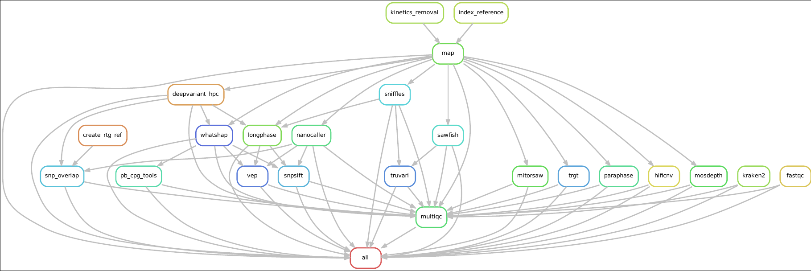
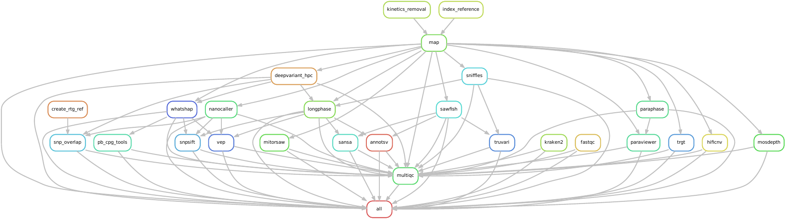

# pb_variants 
A snakemake 9 based Pipeline for hifi snp, sv, cnv calling, phasing and more

Only PacBio data for now

__!!THIS PIPLINE IS IN-DEVELOPMENT AND EXPERIMENTAL, USE AT YOUR OWN RISK!!__

## what this tool aims to deliver:
    - newest and best tools suited for HiFi data (only for now)
    - singletons and trio analysis (trio is coming sometime...)
    - human-first (hg38 for now), others should be possible (untested...)

## included tools:
- deepvariant or bcftools for snp calling
- snps get used for phasing with whatshap and longphase
- paraphase 
- trgt
- hificnv 
- pb-cpg-tools (uses whatshap phased .bam file)
- mitorsaw (just hg38)
- sniffles for sv calls that get phased with longphase
- sawfish for svs and cnvs (results phased by sawfish)
- mosdepth, multiqc
- pbmm2 for mapping
- kraken2 for contamination detection (downsamples massively, needs kraken2 database)
- demultiplexing of input as option, will not split the files per barcode.
- for now one .bam per sample
- NanoCaller for phased snp/indel calls
- Variants get annotated if configured through config.yaml:
    - SVs with sansa and AnnotSV
    - SNPs with vep and snpsift
    - both only tested with hg38 for now
- if enabled, SNPs and SVs get overlaped (compared)
    - svs: truvari overlaps sniffles as the "truth" to sawfish data for each sample
    - snps: rtg-tools overlaps deepvariant or bcftools snps as the "truth" to nanocaller snps for each sample
- if enabled, paraphase results get visualized with paraviewer

## how to run
- make sure you have a conda environment active with snakemake9+ (called smk9 in the runPipeline_local.sh)
    - this can also be achieved by running the included setupPipeline_hpc.sh
        - that script uses conda to create the env smk9 - with snakemake 9 installed already (check file smk9.yaml)
- cp/mv/ln your unmapped .bam file into the root folder of this directory (pb_variants/your_bam_file_here.bam)
- edit samplesheet.csv with your filename 
    - one sample per line, do not delete the header line (add to line2: your_bam_file_here.bam)
- edit config.yaml to your liking/ folder structure (enable only things you want / need. keep in mind some analysis are hg38 only)
- make sure you are in an interactive terminal session inside a screen / tmux or similar
- bash runPipeline_local.sh for local installment on single-server setups, 
- bash runPipeline.sh on HPC 
- non-hpc users need to edit the config.yaml and enable deepvariant and disable deepvariant_hpc in the config.yaml:
use_deepvariant_hpc: True <- only set this to True on HPC HILBERT

# DAG
Before each start, a DAG is created visualising the planned tasks for each sample.
An example:

All options enabled:

Minimalistic execution (and bcftools instead of Deepvariant) with only mandatory tasks:

## output files
- the first step of the pipeline is to strip the kinetics data out of the .bam input file, but keep the methylation data. This makes all following processes much faster without any real data loss. 
- for each input sample:
    - mosdepth and kraken (optional) report that get summarized with multiqc
    - mapped .bam file haplotaged with whatshap and longphase
    - the with whatshap phased bam is used for methylation track generation with cpg_tools
    - bed/bw file for methylation tracks for IGV, should be used together with the whatshap phased output .bam file
    - .vcf(.gz) file for:
        - snps / indels from deepvariant or bcftools, phased with whatshap and longphase
        - trgt
        - paraphase
        - mitorsaw
        - hificnv
        - sawfish sv / cnv 
        - svs from sniffles phased with longphase
        - snps / indels from nanocaller
    - phased snps and svs get annotated with snpsift and sansa and annotsv and vep   
- snakemake report, rulegraph, copy of samplesheet and config.yaml with timestamp

# general workflow in short:

## prep the files:

1. - move all .bam files into the folder pb_variants. (up to 100 at once makes sense, more overloads the hpc for sure)
	- with methylation, no kinetics needed

2. - edit the config.yaml according to your needs. Mostly True/False. If unsure, keep as is but CHANGE THE OUTPUT DIRECTORY

3. - edit the samplesheet.csv: keep the first line and then list all .bam files that you want to analyze in the run. all files listed in that file NEED TO BE IN THE FOLDER 

## now the actual pipeline execution:

1. - start a screen session on the hpc

2. - start an interactive job inside the screen session with at least 2 days runtime

3. - cd into the folder pb_variants

4. - activate the correct conda env with: "conda activate smk9"

5. - run the pipeline with:"bash runPipeline.sh"

## supervising the run:

- check the screen regulary if you want -red colour is bad

- qstat -u your_hpc_username if you want

- check outputfolder if files are appearing

- check clusterlogs_your_hpc_username for errors

- check outputfolder/logs for errors that occured

- if a multiqc_report.html is in the outputfolder then the pipeline is done

- if the interactive job is done, but the pipeline is not done yet, retry

- if you want to understand more, email me

## transfering results:

- you can transfer the complete outputfolder if you want. all results are stored in subfolders that should explain themselves.

## roadmap:
  trio calling : deeptrio, glnexus  -> only if there are requests for this. 
  assembly : hifiasm or similar -> only if there are requests for this. 
  str profiling: strkit, currently testing

## why this work is being done:
- nf-core/pacvar: https://nf-co.re/pacvar/1.0.1/
    - does not run without sudo for us
    - seems not mature enough (imho)
    - not newest tools included
    - not all wanted tools included

- pacbios wdl-based workflow: https://github.com/PacificBiosciences/HiFi-somatic-WDL
    - doesnt run on our hardware

- other, locally developed snakemake-based workflows: (eg: https://github.com/core-unit-bioinformatics/workflow-smk-longread-variant-calling)
    - not all wanted tools included

- Radboud's Valentine workflow:
    - not available to us
    - not all wanted tools included

- smrtlinks internal pipeline:
    - singularity not working, limited tool options
    - not all wanted tools included
